# Auto-Delegation System Guide

## Overview

The Growing Collective uses an **auto-delegation system** that automatically routes tasks to specialized AI agents. This system operates invisibly, making intelligent routing decisions without requiring you to manage which agent handles what.

## System Architecture

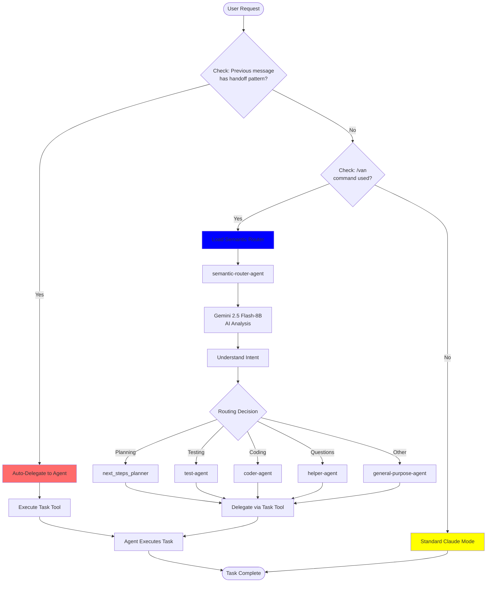

## Three Operating Modes

### 1. Auto-Delegation Mode (Highest Priority)

**When it activates**: When an agent hands off work to another agent

**How it works**:
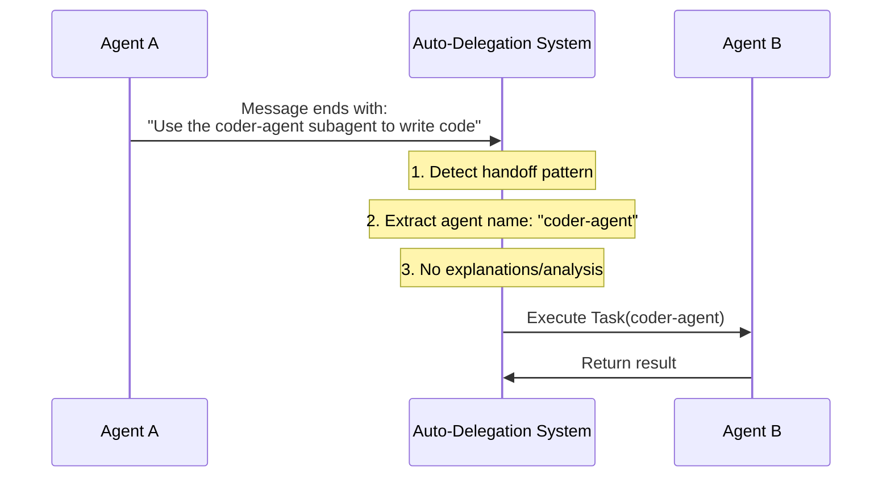

**Key characteristics**:
- Completely automatic
- No user intervention needed
- No explanatory text added
- Immediate execution
- Takes precedence over everything else

**Handoff pattern**:
```
Use the [agent-name] subagent to [task description]
```

**Examples**:
- `Use the coder-agent subagent to write a function`
- `Use the test-agent subagent to validate the UI`
- `Use the next_steps_planner subagent to create implementation plan`

### 2. Explicit Routing Mode (/van command)

**When it activates**: When user types `/van` followed by a request

**How it works**:
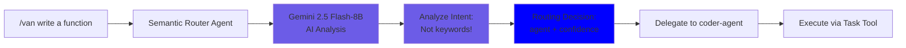

**AI-Powered Semantic Routing** (NO keyword matching):

**All /van requests** → semantic-router-agent → Gemini AI Analysis → Target agent

- **How it works**: Gemini 2.5 Flash-8B understands natural language intent
- **Cost**: ~$0.00005 per request (effectively free with 1,500 req/day free tier)
- **Accuracy**: >90% routing accuracy with >85% average confidence
- **Flexibility**: Handles informal language, ambiguous requests, and edge cases

**Available Target Agents:**
1. **next_steps_planner** - Plans, roadmaps, implementation strategies
2. **coder-agent** - Code writing, implementation, building features
3. **test-agent** - Testing, browser automation, validation
4. **helper-agent** - Questions, explanations, teaching
5. **general-purpose-agent** - Custom tools (time, calculator)

### 3. Standard Mode (Default)

**When it activates**: Normal conversation without `/van` or handoffs

**How it works**: Regular Claude behavior with auto-delegation capability running in background

## Complete Request Flow

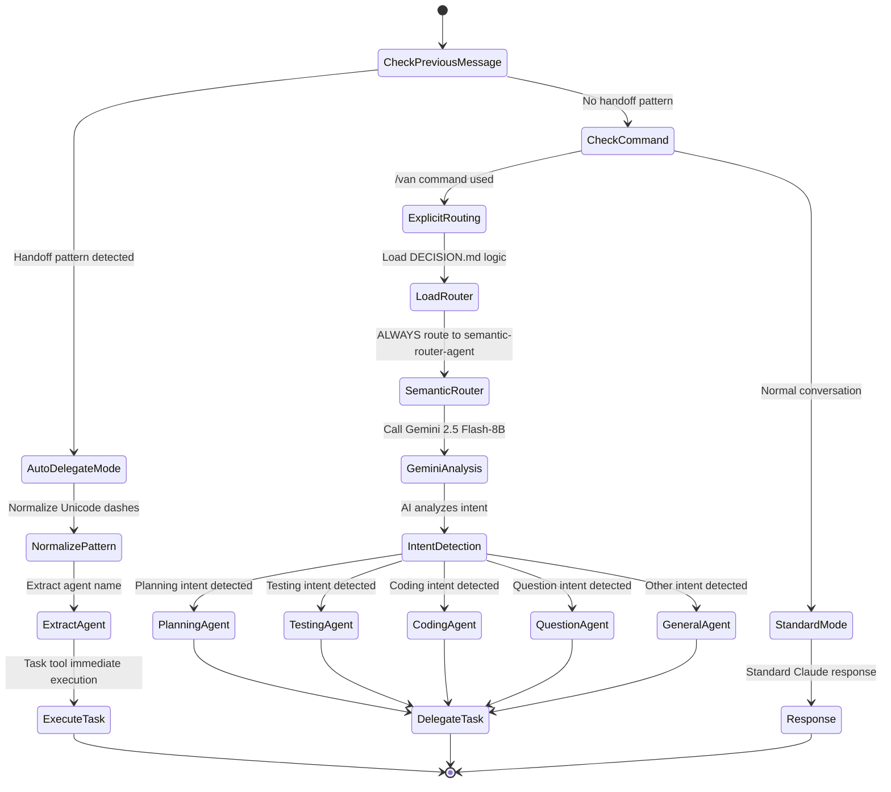

## Agent Handoff Chain Example

Here's how agents can chain together through auto-delegation:

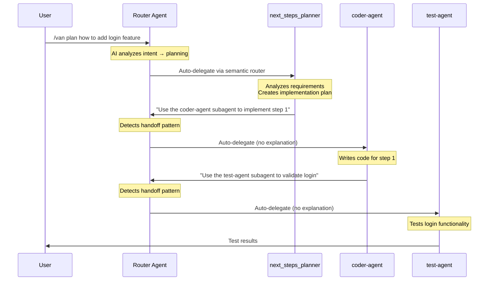

## Routing System Details

### Handoff Pattern Recognition

The system looks for this exact pattern for agent-to-agent handoffs:
```regex
Use the ([a-z0-9-]+) subagent to .+
```

**Unicode normalization**: Converts all dash variants to standard `-`:
- `‑` (non-breaking hyphen)
- `–` (en dash)
- `—` (em dash)
- `−` (minus sign)

### AI-Powered Semantic Routing

**NO keyword matching** - All routing uses Gemini AI analysis:

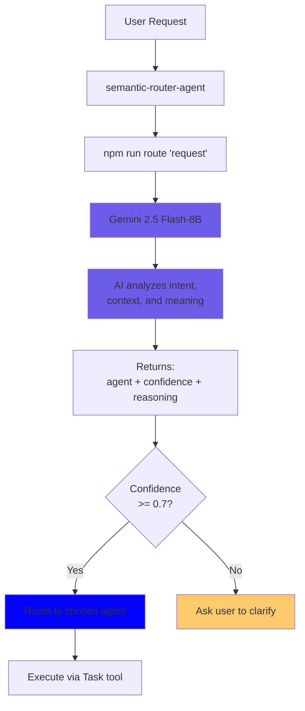

**Why AI routing is superior**:
- **No keyword conflicts**: "plan to write tests" correctly routed based on actual intent
- **Natural language**: Handles "yo, what's next boss?" as naturally as "plan the next steps"
- **Context aware**: Understands nuance, not just word matching
- **Self-improving**: Better with more diverse requests

## Available Agents

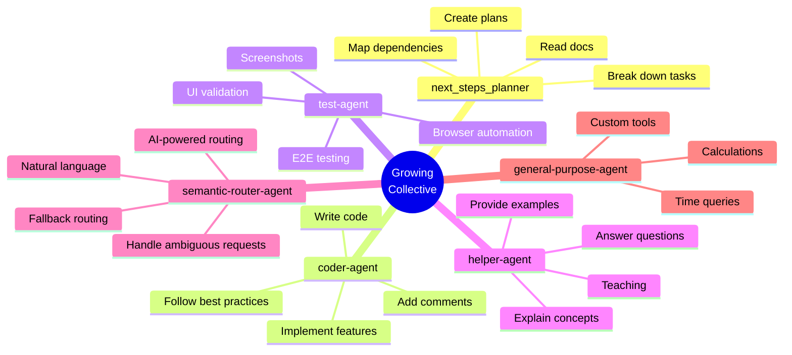

### Agent Specializations

| Agent | Purpose | Tools | Routing |
|-------|---------|-------|---------|
| **semantic-router-agent** | AI-powered routing - analyzes ALL /van requests | Gemini 2.5 Flash-8B API | Entry point for all /van |
| **next_steps_planner** | Documentation analysis, implementation planning | Read, Write, Edit, Bash, Grep, Glob | Routed by AI |
| **coder-agent** | Code generation, implementation | Read, Write, Edit, Bash, Grep, Glob | Routed by AI |
| **test-agent** | Browser automation, testing | Puppeteer MCP, Context7 MCP | Routed by AI |
| **helper-agent** | Answering questions, explanations | Read, Write, Edit, Bash, Grep, Glob | Routed by AI |
| **general-purpose-agent** | Custom tool demonstrations | get_current_time, calculator | Routed by AI |

## How to Use the System

### As a User

**Option 1: Let auto-delegation work invisibly**
```bash
/van write a login function
# System automatically routes to coder-agent
# coder-agent might hand off to test-agent
# You see seamless results
```

**Option 2: Direct routing with /van**
```bash
/van plan the authentication system
# Routes to next_steps_planner explicitly

/van test the homepage
# Routes to test-agent explicitly

/van explain async/await
# Routes to helper-agent explicitly
```

**Option 3: Normal conversation**
```bash
# Just ask questions naturally
What's the difference between let and const?
# Standard Claude mode, no routing
```

### As a Developer

**Creating agent handoffs in agent markdown files**:

```markdown
## Your Agent Instructions

1. Do task A
2. Do task B
3. If user needs testing, end with:

Use the test-agent subagent to validate the implementation
```

**The pattern must be exact**:
- Start with "Use the "
- Agent name (lowercase, hyphens allowed)
- " subagent to "
- Task description

## System Benefits

### 1. Invisible Orchestration
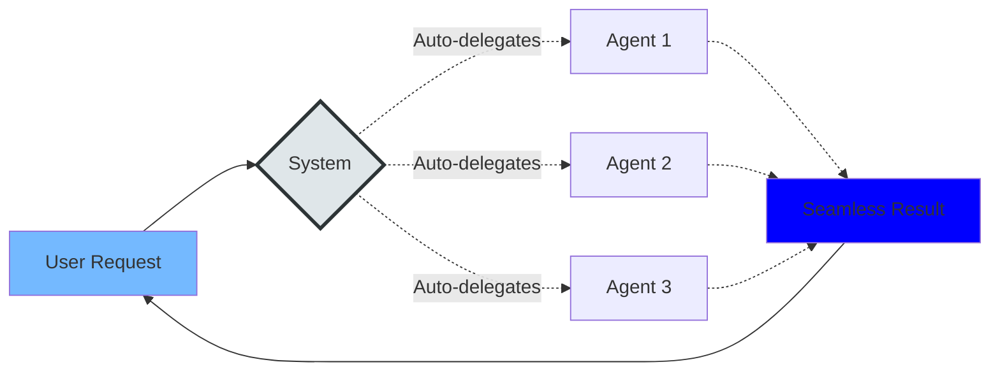

Users don't see the complexity - just results.

### 2. Agent Specialization

Each agent is **expert** at one thing:

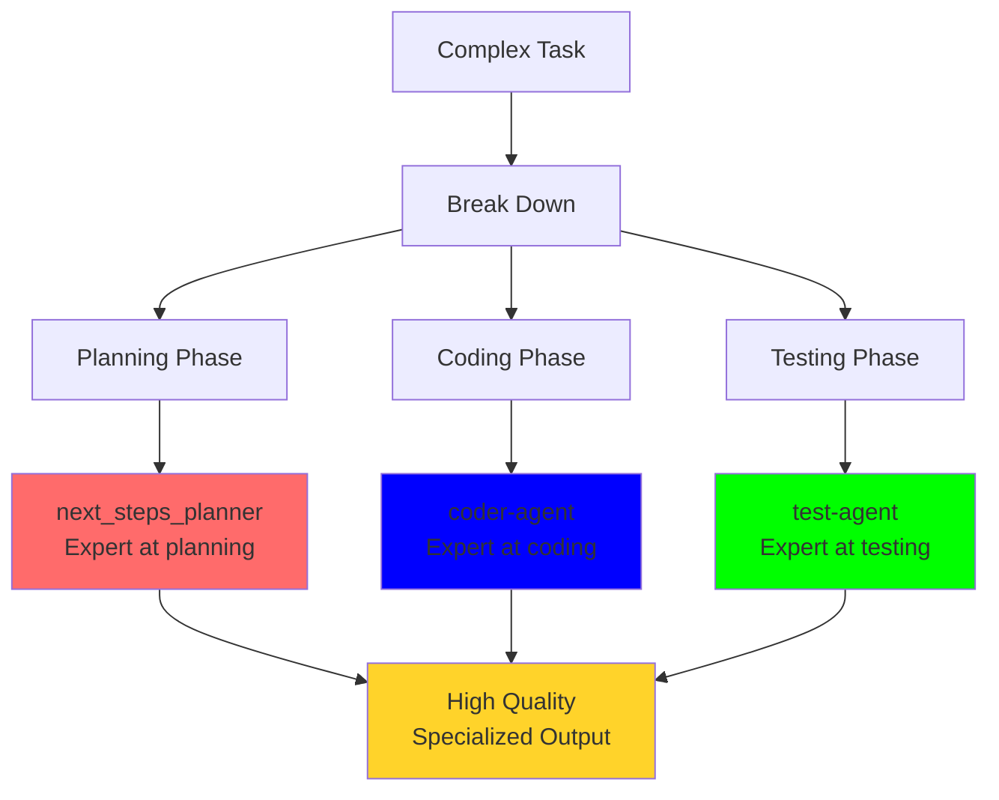

### 3. Extensibility

Adding new agents is easy:

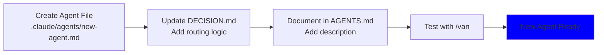

## Troubleshooting

### Handoff Not Working?

**Check pattern exactly**:
```markdown
✅ Correct:
Use the coder-agent subagent to write the code

❌ Wrong:
- Use coder-agent to write the code (missing "the" and "subagent")
- Use the coder_agent subagent to write (underscore instead of hyphen)
- Use the coder-agent to write (missing "subagent")
```

### Wrong Agent Routed?

**AI routing is context-aware** - no more keyword conflicts:
```bash
# Old system (keyword-based):
/van plan to write code
# Would route to: next_steps_planner (planning keyword priority)

# New system (AI-based):
/van plan to write code
# AI analyzes INTENT and routes correctly based on context
# Might route to: next_steps_planner (if emphasis is on planning)
# Or route to: coder-agent (if emphasis is on implementation)
```

**If routing seems wrong**:
1. Check the confidence score in semantic-router-agent output
2. Rephrase your request to be more explicit
3. Report patterns to improve the Gemini training

### Semantic Router Not Working?

**Check the CLI tool**:
```bash
npm run route "test request"
# Should return: {agent, confidence, reasoning}
```

**If it fails**:
- Ensure Gemini API key is configured
- Check `servers/semantic-router/` setup
- Verify `npm install` ran successfully

### Unicode Issues?

The system automatically normalizes these:
- `Use the coder‑agent` → `Use the coder-agent` ✅
- `Use the coder–agent` → `Use the coder-agent` ✅
- `Use the coder—agent` → `Use the coder-agent` ✅

## Advanced: Semantic Router Agent

The semantic router is now the **PRIMARY routing mechanism** for all /van requests:

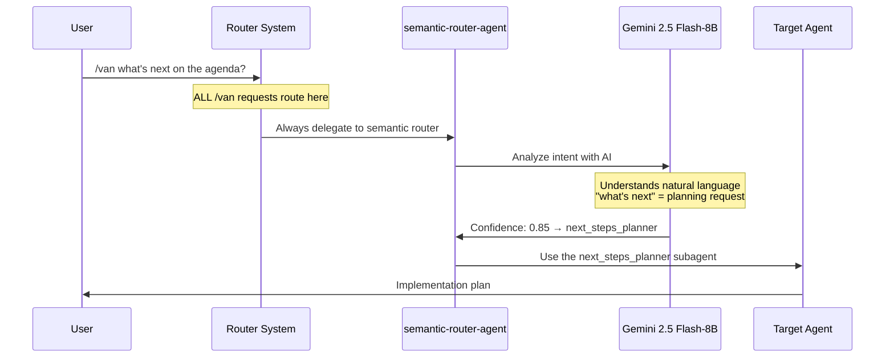

**Cost**: ~$0.00005 per request (effectively free with 1,500 req/day limit)

## File Structure

```
growing_collective/
├── .claude-collective/
│   ├── DECISION.md          # Core routing logic
│   └── AGENTS.md            # Agent catalog
├── .claude/
│   ├── agents/
│   │   ├── next_steps_planner.md
│   │   ├── coder-agent.md
│   │   ├── test-agent.md
│   │   ├── helper-agent.md
│   │   ├── semantic-router-agent.md
│   │   └── general-purpose-agent.md
│   └── hooks/
│       └── load-decision.sh  # Startup hook
└── CLAUDE.md                 # Main config (imports DECISION.md)
```

## Summary

The auto-delegation system provides:

1. **Invisible orchestration** - Agents coordinate without user intervention
2. **Smart routing** - AI-powered semantic analysis routes to the right specialist
3. **Seamless handoffs** - Agents delegate to each other cleanly
4. **Intent understanding** - AI analyzes meaning, not just keywords
5. **Natural language** - Handles formal and informal requests equally
6. **Extensible architecture** - Easy to add new specialists

You can use `/van` for explicit routing or let the system work invisibly through auto-delegation. Either way, specialized agents ensure high-quality, focused results.

---

**Quick Reference**:
- `/van [request]` - AI-powered semantic routing (NO keywords)
- Normal chat - Standard mode
- Handoff pattern: `Use the [agent-name] subagent to [task]`
- Routing: ALL /van → semantic-router-agent → AI analysis → target agent
